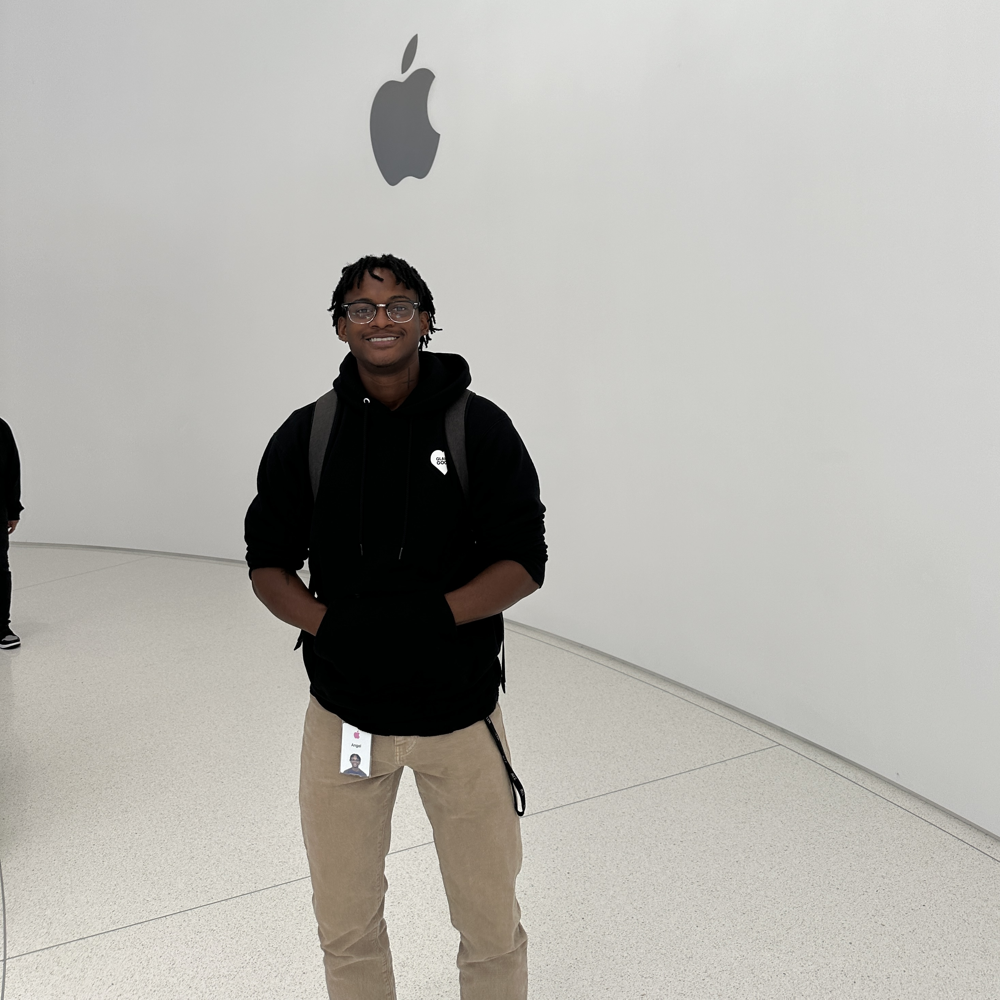

# About Me

## Meet Angel

{:height='auto'}{:width='300'}

Hi! {{ name }} I'm a full-stack developer that likes to pursue fun, meaningful projects.

Some fun facts about me:  
:sunny: I'm from Los Angeles, California.  
:bar_chart: I have passions in machine learning, community service, and entrepreneurship.  
:boxing_glove: To stay active, I enjoy boxing and going to the gym.

## Experience
- Worked on full-stack projects at Amazon, AWS, and Apple.

## Education
{:width='50%'}
:mortar_board: Graduated Valedictorian, Hollywood High School Class of 2021  
:beaver: MIT Class of 2025  
:books: Computer science & engineering major with a minor in comparative media studies

