# A2: Divergent Design

## Goals
- **App name:** Crash
- **Audience:** Traveling professionals, interns, & college students
- **Value:** A recurrent issue for many working professionals is business travel. Instead of rebuilding your network from scratch everytime you move to a new city, tap into local communities well ahead of time with Crash.

## Comparables

|                                                                                         Source                                                                                          |                                                                                                     Usefulness                                                                                                      |
|:---------------------------------------------------------------------------------------------------------------------------------------------------------------------------------------:|:-------------------------------------------------------------------------------------------------------------------------------------------------------------------------------------------------------------------:|
|                            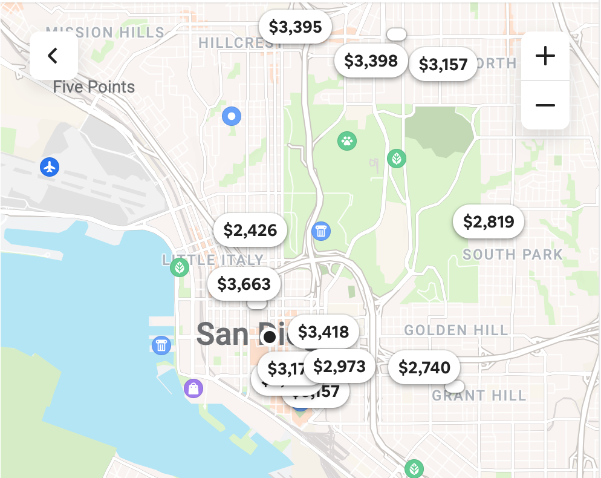{:width='100%'} *Airbnb displays available rentals by price on an interactive map*                            |                         Similarly to how rentals are displayed by price on a map, potential roommates/groups of roommates in a travel destination could also be shown on an interactive map                         |
|                            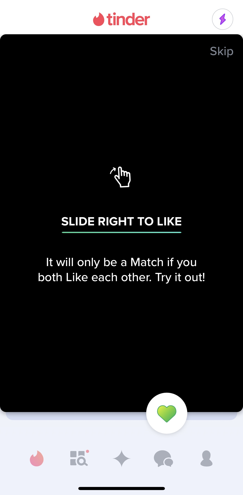{:width='100%'} *Tinder's primary feature, swiping left/right on dating matches*                            |                                             Could repurpose Tinder's swiping mechanism to swipe through potential roommate matches in a user's work travel destination                                              |
|                     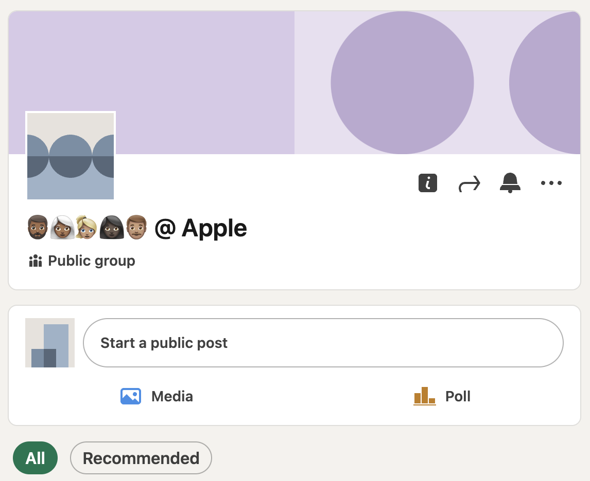{:width='100%'} *A user-created Linkedin group that is viewable/searchable by the public*                      |                                           This concept of user-created, public/private Linkedin groups could be extended to public/private communities of work travelers                                            |
|              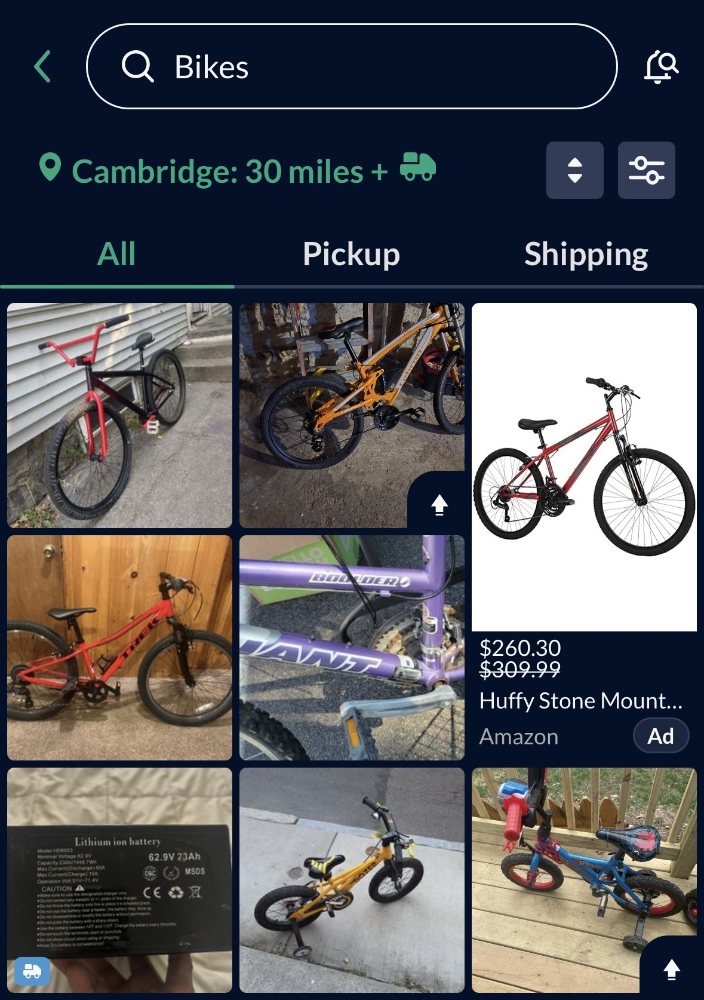{:width='100%'} *Scrollable search results on OfferUp, a popular platform for selling used items*              | Many students, interns, and contractors purchase items for short periods of time and sell them at the end of their stint. What if users could browse sales within their work community, in a UI similar to OfferUp? |
|          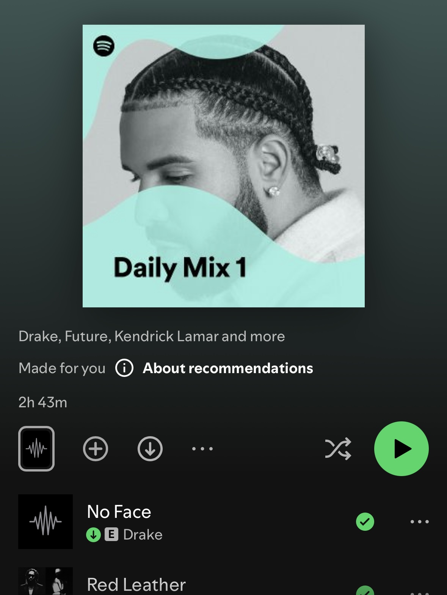{:width='100%'} *Spotify daily mix, a custom playlist based on a user's listening history and learned tastes*           |                                           Can apply this idea to generating users a customized list of recommended roommates, professional communities, and local events                                            |
|                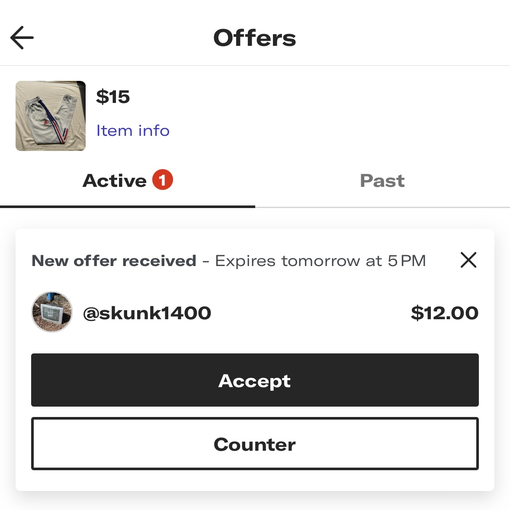{:width='100%'} *Depop allows sellers to view negotiation offers they've received for on-sale items*                |           Could we repurpose this concept of receiving offers for exchanges between work travelers? Offers could become swap requests for exchanging used items, roommates, or even housing arrangements.           |
|                                  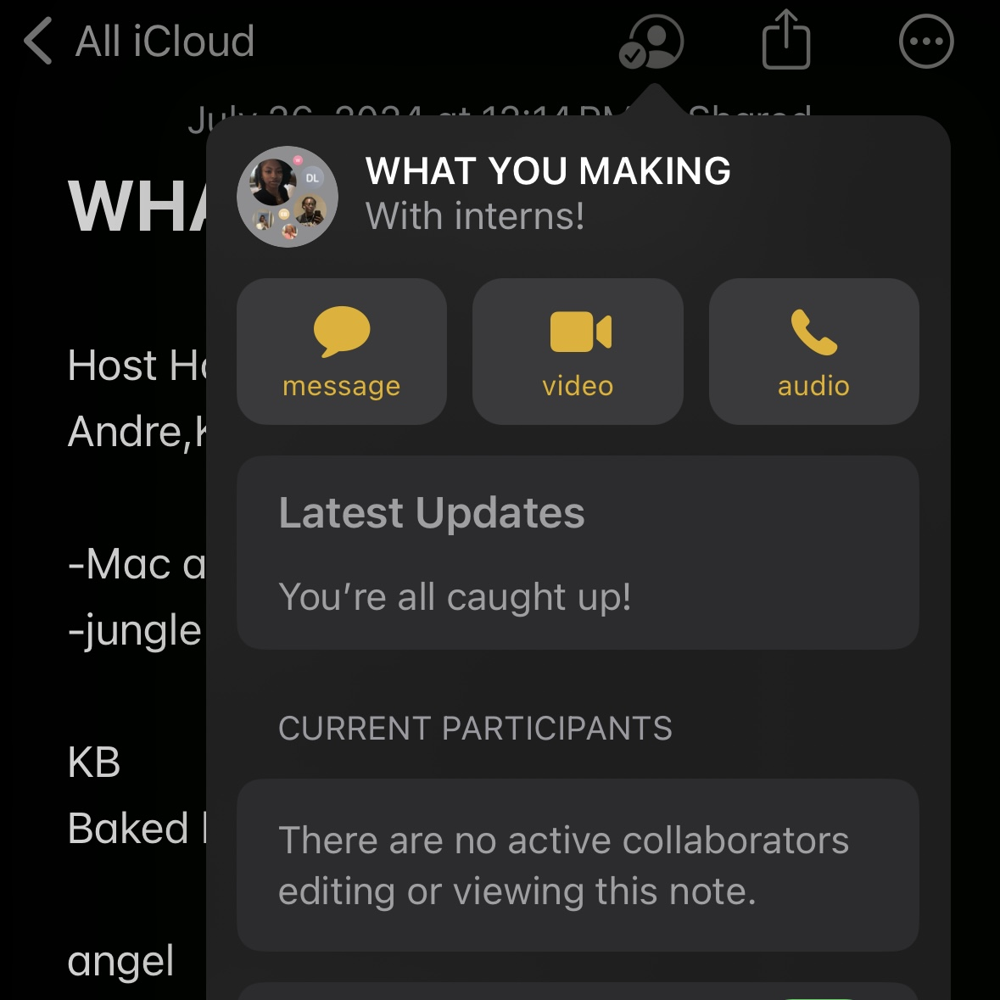{:width='100%'} *Apple's new collaborative note feature*                                  |                   The collaborative note could serve as a model for shared documents between groups of roommates. What if there were collaborative notes for shopping lists or living contracts?                    |
| 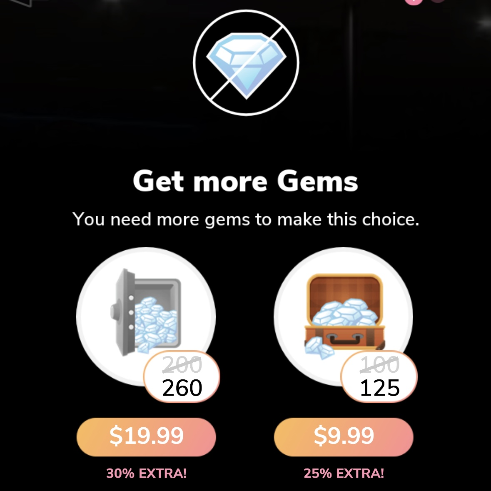{:width='100%'} *Episode, a choose-your-own-adventure type mobile-game, uses gems as the main form of in-game currency* |      Could use some form of in-app currency/points that are used to take "premium" actions or gain access to hidden features. For example, limit how many roommates you can discover unless you spent points.       |
|         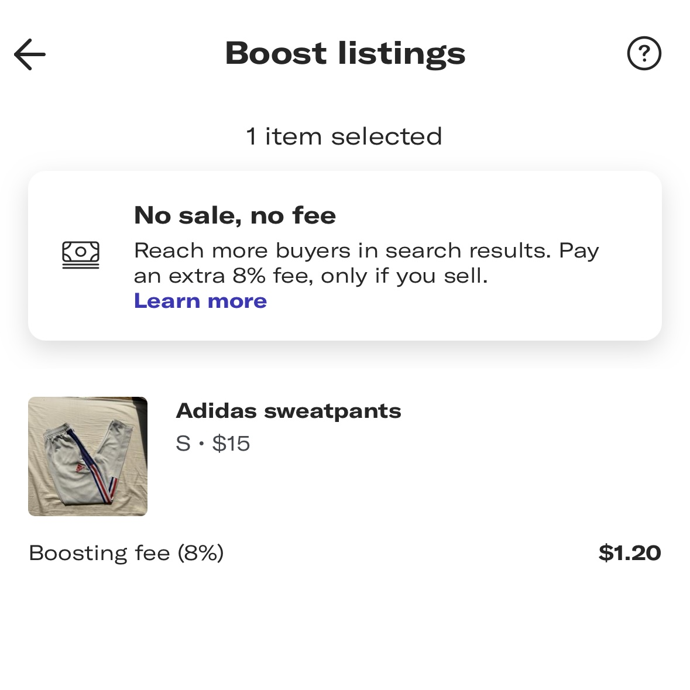{:width='100%'} *Depop allows sellers to "boost" their listings, giving them more visibility for a small fee*         |               What if users had the option to boost their profile visibility in the algorithm, suggesting them to more potential roommates? The fee could be in-app points instead of real currency.                |

## Potential Features

|    |          Name           |                                                                                                                                                    Description                                                                                                                                                     |
|----|:-----------------------:|:------------------------------------------------------------------------------------------------------------------------------------------------------------------------------------------------------------------------------------------------------------------------------------------------------------------:|
| 1  |  Workplace communities  |                                                              Users will have the ability to create and/or join custom work/school-based communities. They'll have the option to list them publicly, or privately with invite/request only privileges.                                                              |
| 2  |      Roommate pods      |   Allow users to create roommate pods that want to secure housing in the same area, work from the same office, etc. These groups will be plotted on a map that is viewable by the entire community. Pods remain "open" for others to request to join until they either reach capacity or the creator closes it.    |
| 3  |    Roommate requests    |                                                           Users can directly request one another to be roommates. It would function like a friend request seen on many other apps, with a user's info and living preferences prefilled into the request.                                                           |
| 4  |   Roommate contracts    |                                         Users with finalized living groups can collaborate on personalized living contracts from within the app. They can define things like quiet hours, rent responsibility, and guest policies, then save it for reference at anytime.                                          |
| 5  |     Roommate finder     |                                                      Swipe through potential roommates in a Tinder-swipe fashion. Quickly view their living preferences and roommate profile, then send a direct roommate request by swiping right if you like what you see.                                                       |
| 6  |  Community jobs board   |                      Internally share job leads with your work/school community. Postings may include application links, manager & recruiter contacts, preferred skills/qualifications, and more. Could have an option for community members to request a referral from the original poster.                       |
| 7  | Community event locator |                                                                                      Users can post events they're hosting to their entire community. Allow users to tag events with locations and view all events on a map.                                                                                       |
| 8  |  Community bargaining   |                                                                                            Sell used items at low prices to other travelers in the community. Optionally tag pickup locations on a community-wide map.                                                                                             |
| 9  |     Roommate radar      |                                                        Generate a personalized list of recommended roommates for users that still need a living group, similar to a Spotify daily mix. Users can be fed these suggestions once a day upon opening the app.                                                         |
| 10 |  AI roommate messaging  |                                                      Reaching out to new people can be scary. While exploring potential roommates, users can use AI to summarize info from their own and another user's profile, then reach out with a personalized message.                                                       |
| 11 |    Roommate swapping    |   Dissatisfied with your current living group? Offer yourself or a roommate up for a swap. Swap requests will include info about the housing arrangement, other roommates, and any other important details in a view similar to that of a Depop offer. Swaps must be confirmed by both parties before finalized.   |
| 12 | Collaborative shopping  |                         Groups of roommates can collaborate on shopping lists of necessities for their shared living space, like a collaborative iPhone note. Group members can check purchased items off the list, notifying the rest of the group that those items have been purchased.                          |
| 13 |    Community trading    |                                                                     Open trade requests for items you own with the rest of your work community. Open trades are geo-tagged on a community map, and users can make trade offers like on Depop.                                                                      |
| 14 | Roommate profile boosts |                                                         Need to finalize your roommate arrangement in a short period of time? Use in-app currency/points to temporarily boost your roommate profile visibility to others within the recommendation system.                                                         |
| 15 | Insider housing reviews |        Give community members the ability to leave ratings, suggestions, and warnings of specific landlords, apartment complexes, or rental sites. Travelers could then search this page for places they may be considering, and get a heads up from verified work travelers that have lived there before.         |
| 16 |    Affinity filters     |                                    Allow tagging of communities, events, roommate pods, and user profiles with different affinities. Users can then filter their search for roommates, professional communities, or local activities by the affinity groups they identify with.                                    |
| 17 |   AI roommate bonding   |                          Have an AI agent scan the profiles & interests of roommate groups, then suggest fun activities for them to partake in together. Could integrate calendar data and work hours from all participants, and directly schedule events at optimal times for everyone.                           |
| 18 |    Chore scheduling     |       Allow living groups to create lists of chores. Can include a calendar view for assigning individual group members to chores at certain time slots. Could have deadlines for when specific chores must be completed, or an auto-scheduler that takes user preferences and assigns chores automatically.       |
| 19 |     Roommate nudges     |                                                                         No one likes confrontation. Have an ability to politely "nudge" your roommates about chores, roommate contract violations, or other concerns from within the app.                                                                          |
| 20 |   Crash currency (CC)   | Crash currency is a form of in-app currency used to take actions like swiping right on roommates, sending direct roommate requests, and boosting profiles. Users will be provided some initial amount of CC, and can acquire more through time spent on the app, watching ads, and inviting users to the platform. |

## Value-sensitive Design
|   |                                                                                                                                                                                      Observation                                                                                                                                                                                       |                                                                                                                                                             Design response                                                                                                                                                             |
|---|:--------------------------------------------------------------------------------------------------------------------------------------------------------------------------------------------------------------------------------------------------------------------------------------------------------------------------------------------------------------------------------------:|:---------------------------------------------------------------------------------------------------------------------------------------------------------------------------------------------------------------------------------------------------------------------------------------------------------------------------------------:|
| 1 |                                                                                       **Stakeholders:** The community jobs board may introduce managers and recruiters as **indirect stakeholders**, negatively impacting their right to privacy through sharing of their personal information.                                                                                        | One possible solution mitigating this effect could be to require consent from the manager or recruiter (via email) to list their information publicly before the job posting goes live. Another idea would be to only allow links to publicly available Linkedin pages instead of personal information like emails, phone numbers, etc. |
| 2 |                        **Stakeholders:** The community event locator, community bargains, and jobs board all create opportunities for **non-targeted use** of the platform by regulars outside the intended audience of traveling professionals. Regular people may seek to promote their events and item sales to a wider audience, or get internal job leads.                        |                                                                       One solution to this issue is verification. Either upon creating an account, or before joining work-based communities, prompt users to verify their member status with a work/school email.                                                                       |
| 3 |                               **Time:** Roommate nudges, while useful for avoiding confrontation, could also discourage groups of roommates from having open, in-person conversations. Users would **adapt** to quickly "resolving" these issues with the click of a button, instead of strengthening their relationships through verbal communication.                                |                                                                  To avoid the collapse of communication, first suggest several conversation starters and have users confirm they’ve attempted to resolve the issue in-person, before allowing them to nudge roommates.                                                                  |
| 4 | **Time:** Families of traveling professionals, including spouses and children, become indirect stakeholders when their traveler uses roommate finder/pods. Stakeholders may wish to **opt-out** of the risks associated with living with someone they met online. This could separate families in cases of  mandatory relocation, or force additional financial strain onto travelers. |                                                                     Allow users to indicate their family status on the roommate profile with a family tag. Enable filtering potential roommates by this family tag, or introduce a roommate finder “for families.”                                                                      |
| 5 |                                              **Pervasiveness:** Looking **across national boundaries,** living with people outside of one’s immediate family or marriage is seen as unconventional and/or financially irresponsible by some cultures. The app’s core roommate features would struggle to gain traction in such countries.                                              |                                    Could disable all roommate related features in certain countries, or make them optional. Could also repurpose roommate contracts, collaborative shopping lists, and nudges for families. Allow users to build family groups and invite family members to the app.                                    |
| 6 |                         **Values:** Professional communities and roommate finder create **value tensions** between real-world interaction, and social networking. Though they promote community building through the expansion of one’s virtual network, they degrade the importance of building strong connections offline through face-to-face interaction.                          |                                             Extend communities with daily community challenges that encourage users to make new connections with members. Use profiles to AI generate potential offline activities from shared interests, and offer to directly book calendar invitations.                                              |
| 7 |                                                                                       **Values:** Community events, bargaining, and trading all involve geo-tagging locations on a community-wide map. These features may compromise a user’s **experience of values** like safety and privacy.                                                                                        |                                                  Conceal an event or user’s true location by only displaying the approximate area to other users. True locations aren’t revealed until an event attendee confirms attendance or a seller confirms intent to meet another user offline.                                                  | |

## Storyboarding

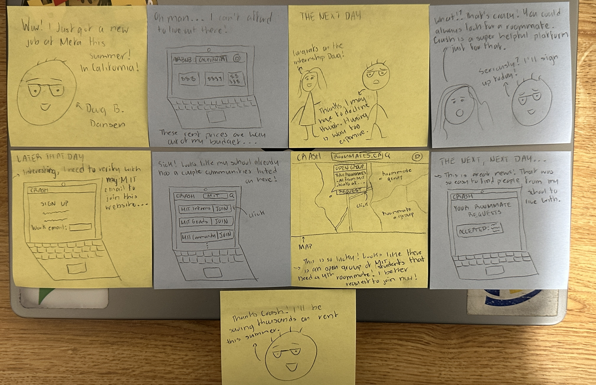 *Flow: Finding a roommate*
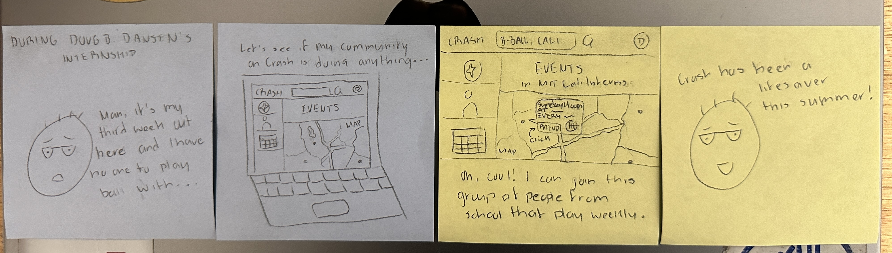 *Flow: Finding people that share your hobbies outside of work*
