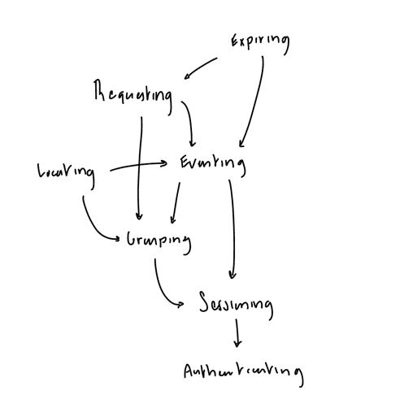
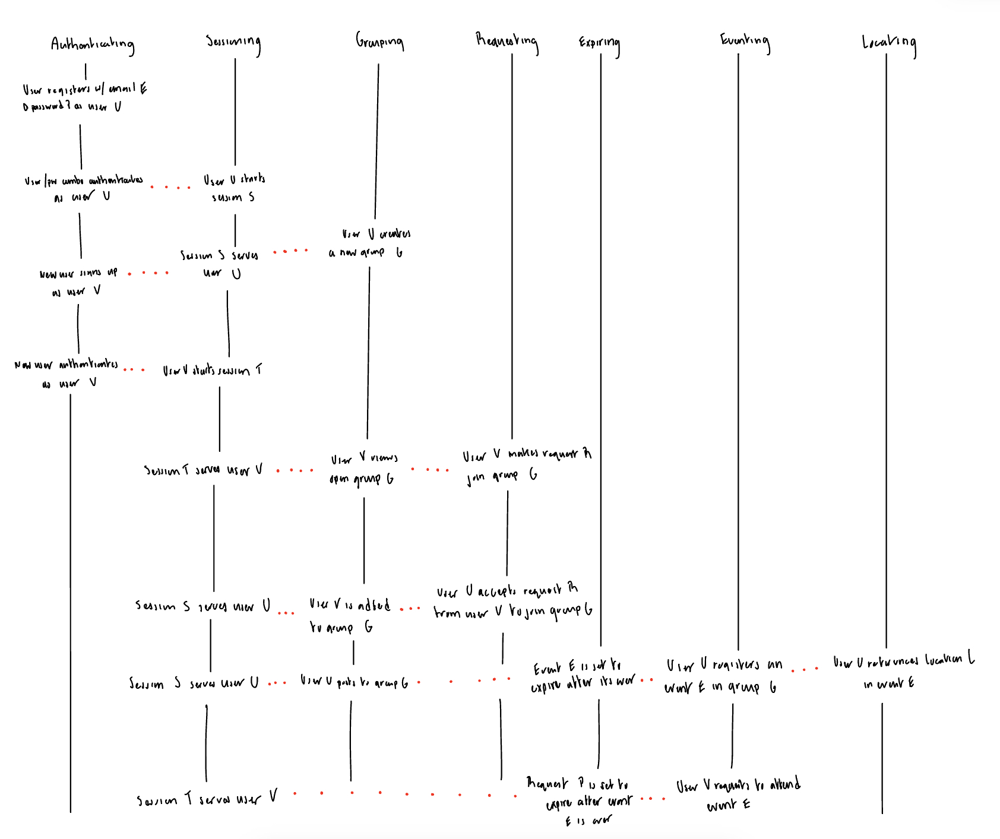

# A3: Convergent Design

## Pitch
A recurrent issue for many working professionals is business travel. Don't waste anymore time rebuilding your network from scratch everytime you move to a new city. Tap into local communities well ahead of time with Crash!

Travelers can easily create and join verified **groups** of coworkers, classmates, and/or potential roommates. Host community-wide **events** to network and meet new people that share your interests, or plan a more personal gathering between roommates. Easily **locate** roommates, communities, and events near you on the map. Make requests to join groups and attend events, and set these requests to automatically **expire** when you need them to.

## Concepts
1. Authenticating 
    - **Purpose:** Authenticate users so that app users correspond to people
    - **Principle:** User **u** registers with username **u**, password **p**, and work/school email **e**. The user can later authenticate with the same **e/p** combo to login.
    - **State:**
      - registered: **set** User
      - username: registered -> **one** String
      - password: registered -> **one** String
      - email: registered -> **one** String
    - **Actions:**
      ```
      register(u: String, p: String, e: String, OUT u: User)
         u := new User(); registered += u;
         u.username := u; m.password := p; m.email := e;
      
      delete(e: String, p: String)
         e.~email == p.~password; 
         m := e.~email; registered -= m; 
         m.email := none; m.username := none; m.password := none;
         
      authenticate(e: String, p: String, OUT m: User)
         e.~email == p.~password; m := e.~email;
      
      checkUserExists(e: String, OUT ret: Boolean)
         ret := e.~email != none;
      
      verifyEmail(e: String, OUT ret: Boolean)
          // Verifies use of a work/school email
      ```
2. Sessioning
    - **Purpose:** Allow user authentications to persist for extended periods of time.
    - **Principle:** User **u** starts session **s**, allowing the app to retrieve user **u** bound to session **s** at anytime until **s** ends.
    - **State:**
        - active: **set** Session
        - user: active -> **one** User
        - activeGroup: active -> **one** Group
    - **Actions:**
    ```
    start(u: User, OUT s: Session)
         s := new Session();
         active += s; s.member := m;
   
    getUser(s: Session, OUT m: User)
         u := s.user;
   
    end(s: Session)
         active -= s; s.user := none
   
    setActiveGroup(s: Session, group: Group)
         s.activeGroup := group;
   
    getActiveGroup(s: Session, OUT group: Group)
         group := s.activeGroup;
    ```
3. Expiring
   - **Purpose:** Allocate and expire timed resources
   - **Principle:** 
   - **State:**
     - active: **set** Resource
     - expiry: active -> **one** Date
   - **Actions:**
     ```
     allocate(r: Resource, d: Date)
         r not in active; active += r; 
         r.expiry := d;
     
     deallocate(r: Resource)
         r in active; active -= r;
         r.expiry := none;
     
     system expire(r: Resouce)
         r.expiry <= Date.now();
         active -= r; r.expiry := none
     ```
4. Grouping
    - **Purpose:** Link users who currently share/plan to share a household, workplace, or school community
    - **Principle:** User **o** creates a group named **n** with privacy level **p**, location **l**, and optional capacity **c**, then becomes the owner of that group. Group **n** is open to another user **u** to join as long as the group is public, not at capacity, and hasn't been disbanded by the owner.
    - **State:**
        - groups: **set** Group
        - name: groups -> **one** String
        - owner: groups -> **one** User
        - members: groups -> **set** User
        - private: groups -> **one** Boolean
        - location: groups -> **one** Location
        - capacity: groups -> **opt** Integer
    - **Actions:**
      ```
      create(n: String, o: User, p: Boolean, l: Location, c: Integer = none, OUT g: Group)
         n.~name == none; g := new Group(); groups += g; 
         g.name := n; g.owner := o; g.members := {o}; 
         g.private := p; g.capacity := c; g.location := l;
        
      disband(g: Group)
         g in groups; groups -= g;
         g.name := none; g.owner := none; g.members := none; 
         g.private := none; g.capacity := none; g.location := none
        
      join(g: Group, u: User)
         g in groups; u not in g.members; |g.members| < g.capacity;
         g.members += u;
      
      leave(g: Group, u: Member)
         g in groups; u in g.members;
         g.members -= u;
        
      changePrivacy(g: Group, u: User)
         u == g.owner; g.private := ~g.private;
 
      getPrivacy(g: Group, OUT p: Boolean)
         p := g.private; 
      
      getOwner(g: Group, OUT o: User)
         o := g.owner;
      
      confirmOwner(g: Group, u: User)
         g.owner == u;
      ```
5. Requesting
   - **Purpose:** Allow users to request actions from one another 
   - **Principle:** Member **s** opens a request to member **t** for access some resource **r** (optional), creating a new Request **req**. Request **req** is pending until member **t** closes it by accepting/declining, or member **s** withdraws it.
   - **State:**
     - requests: **set** Request
     - sender, recipient: requests -> **one** User
     - resource: requests -> **opt** Resource
     - **Actions:**
       ```
       open(s: User, t: User, rsrc: Resource, OUT req: Request)
           req := new Request(s, t, rsrc); requests += req;
           req.sender := s; req.recipient := t; req.resource := rsrc;
     
       close(r: Request, OUT sender: User, rsrc: Resource)
           r in requests; r -= r; 
           rsrc := r.resource; sender := r.sender;
           r.sender := none; r.recipient := none; r.resource := none;
       
       getSent(s: User, OUT sent: set Request)
           sent := s.~sender;
       
       getReceived(t: User, OUT received: set Request)
           received := t.~recipient;
       
       verifyRecipient(r: Request, user: User)
           user == r.recipient;
       ```
6. Eventing
    - **Purpose:** Allow members to host and promote community-wide events.
    - **Principle:** Member **h** registers an event in group **g** with start time **s**, end time **e**, location **l**, and capacity **c**, becoming the host of said event. Other users may then confirm/unconfirm their attendance to the event unless it has already ended, reached capacity, or been unregistered by the host.
    - **State:**
      - events: **set** Event
      - name: events -> **one** String
      - group: events -> **one** Group
      - host: events -> **one** User
      - attendees: events -> **set** User
      - startTime: events -> **one** Date
      - endTime: events -> **one** Date
      - capacity: events -> **one** Integer
      - location: events -> **one** Location
    - **Actions:**
      ```
      register(n: String, g: Group, h: User, s: Date, e: Date, c: Integer, l: Location, OUT event: Event)
         event := new Event(n, g, h, s, e, c, l); events += e;
         e.name := n; e.group := g; e.host := h; 
         e.attendees := {h}; e.startTime := s; e.endTime := e;
         e.capacity := c; e.location := l;
      
      unregister(e: Event)
         e in events; events -= e;
         e.name := none; e.group := none; e.host := none; 
         e.attendees := none; e.startTime := none; e.endTime := none;
         e.capacity := none; e.location := none;
      
      attend(e: Event, u: User, OUT loc: Location)
         e in events; u not in e.attendees;
         e.attendees += u; loc := e.location;
      
      unattend(e: Event, u: User)
         e in events; u in e.attendees;
         e.attendees -= u;
      
      confirmHost(e: Event, u: User)
         e.host == user;
      
      getHost(e: Event, OUT host: User)
         host := e.host;
      
      checkCapacity(e: Event)
         |e.attendees| < e.capacity;
      
      ```
7. Locating
    - **Purpose:** Allow users to tag resources with locations.
    - **Principle:** A user creates named location **l** when tagging some resource with an address, longitude, and latitude. The location is implicitly deleted whenever the geo-tagged resource is deleted.
    - **State:** 
      - locations: **set** Location
      - name: locations -> **one** String
      - address: locations -> **one** String
      - longitude: locations -> **one** Float
      - latitude: locations -> **one** Float
    - **Actions:**
      ```
      create(name, addr: String, long, lat: Float, OUT loc: Location)
         addr.~address == none;
         loc := new Location(name, addr, long, lat); 
         locations += loc;
      
      delete(loc: Location)
         loc.name := none; loc.address := none;
         loc.longitude := none; loc.latitude := none;
         locations -= loc;

      getByName(n: string, OUT loc: Location)
         loc := n.~name;
      
      getAll(OUT places: set Location)
         places := locations;
         
      ```

## Dependency Diagram


#### Potential subsets
- \{ Expiring, Requesting, Eventing, Grouping, Sessioning, Authenticating \}
- \{ Locating, Eventing, Grouping, Sessioning, Authenticating \}
- \{ Requesting, Grouping, Sessioning, Authenticating, \}
- \{ Sessioning, Authenticating \}

## Synchronizations
```
include Authenticating, Sessioning, Expiring, Grouping, Eventing, Requesting, Locating

sync login (email, password: String, OUT user: User, s: Session)
   when Authenticating.authenticate (email, password, user)
   Sessioning.start (user, s)

sync logout (s: Session)
   Sessoning.end (s)

sync createGroup (s: Session, name: String, priv: Bool, cap: Int, addr: String, long, lat: Float, OUT group: Group, loc: Location)
   Sessioning.getUser (s, OUT user)
   Locating.create (addr, long, lat, OUT loc)
   Grouping.create (name, user, priv, loc, cap, OUT group)
   Sessioning.setActiveGroup(s, group)

sync leaveGroup (s: Session, group: Group)
   Sessioning.getUser (s, OUT user)
   Grouping.leave (group, user)

sync disbandGroup (s: Session, group: Group)
   Sessioning.getUser (s, OUT user)
   Grouping.confirmOwner(group, user)
   Grouping.disband (group)

sync createEvent (s: Session, name: String, start, end: Date, cap: Int, addr: String, long, lat: Float, OUT event: Event loc: Location)
   Sessioning.getActiveGroup(s, OUT group)
   Sessioning.getUser (s, OUT user)
   Locating.create (addr, long, lat, OUT loc)
   Eventing.register (name, group, user, start, end, cap, loc, OUT event)
   Expiring.allocate (event, end)

sync leaveEvent (s: Session, event: Event)
   Sessioning.getUser (s, OUT user)
   Eventing.unattend(event, user)

sync deleteEvent (s: Session, event: Event)
   Sessioning.getUser (s, OUT user)
   Eventing.confirmHost(event, user)
   Eventing.unregister (event)
   Expiring.deallocate (event)

sync makeGroupRequest (s: Session, group: Group, OUT req: Request)
   Sessioning.getUser (s, OUT user)
   Grouping.getOwner (group, OUT owner)
   Requesting.open (user, owner, group, OUT req)

sync makeEventRequest (s: Session, event: Event, OUT req: Request)
   Eventing.checkCapacity(event)
   Sessioning.getUser (s, OUT user)
   Eventing.getHost (event, OUT host)
   Requesting.open (user, host, event, OUT req)

sync acceptGroupRequest (s: Session, req: Request)
   Sessioning.getUser (s, OUT user)
   Requesting.verifyRecipient (req, user)
   Requesting.close (req, OUT sender, group)
   Grouping.join (group, sender)

sync acceptEventRequest (s: Session, req: Request)
   Sessioning.getUser (s, OUT user)
   Requesting.verifyRecipient (req, user)
   Requesting.close (req, OUT sender, event)
   Eventing.attend (event, sender)

sync endEvent (event: Event)
   when Expiring.expire (event)
   Eventing.unregister (event)


```


## Wireframes
[Figma](https://www.figma.com/proto/hhQz5a7z32cwxzDbiMzv2b/Crash?node-id=14-212&node-type=symbol&t=lPX2Hh70oYwOgPfY-1&scaling=scale-down&content-scaling=fixed&page-id=0%3A1&starting-point-node-id=14%3A212)

## Design Tradeoffs
- **Generalized or specific groups**
   - Unify: Roommate groups and work communities could appear as distinct entities in the UI, while actually being different instances of the same Group concept
   - Specialize: Implement roommate grouping and work communities as their own separate concepts. Roommate groups can be request-only by design, without maintaining any privacy level in its state.
   - Outcome: Unify roommate groups and work communities in a single Grouping concept, since both represent collections of users and share much of the same state. Roommate groups are always instantiated with private = true to enable request-only features.
- **Timed resources**
  - Factor & specialize: Have concepts like Eventing and Requesting handle the allocation and expiration of their own time-constrained resources uniquely.
  - Unify & generalize: Include an Expiring concept that generally keeps track of timed resources from any concept. Requires some tightening between Eventing/Expiring and Requesting/Expiring at call time.
  - Outcome: Added an Expiring concept to handle allocating/expiring all timed resources with expiry dates. Avoids duplicating cleanup actions across concepts, and wasting DB space on multiple sets of expiration Dates. 
- **Request-only events**
   - A: Make events open to all by default. Omit any privacy state variable in the Eventing concept that could toggle between open & request-only mode.
   - B: Having Eventing include some privacy state that allows users to select whether they want an event to be request-only or open-to-all. 
   - Outcome: Made events open to any user to attend by default, but require Events to be instantiated within some parent Group. To protect privacy and safety, Groups can be set to request-only to prevent anyone from gaining access to its Events. To encourage openness and inclusivity, Events must be available to anyone within the Group to attend.