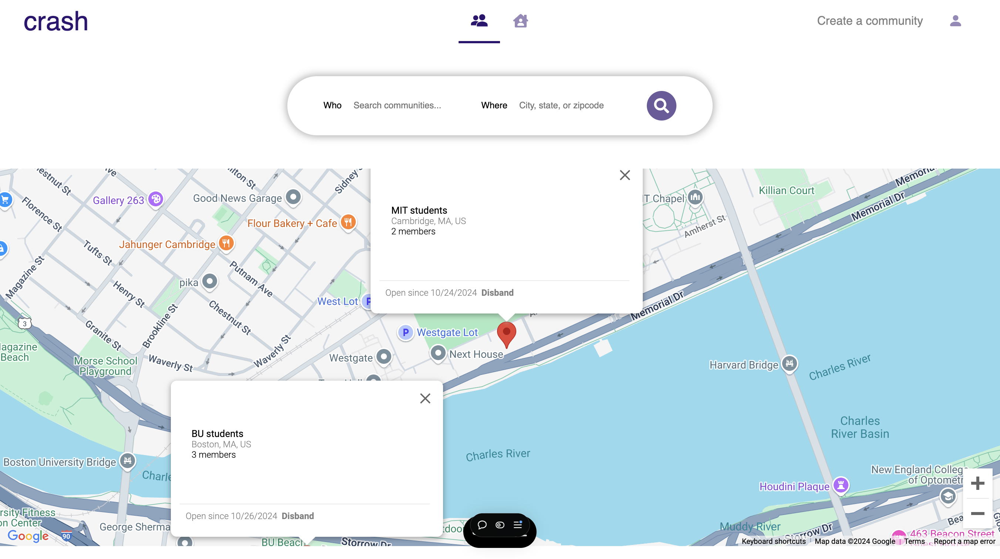
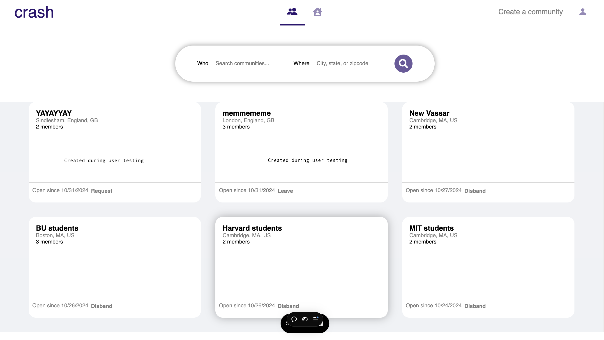

# A6: User Testing & Analysis

## Prepopulated data

## Task list
**Prompt:** You are a college student that just got a summer internship at Meta in California. Living alone is too expensive, so you want to use Crash to discover other verified work travelers to live with.

|           Title           |                                                                       Instruction                                                                       |                                                                                                                                        Rationale                                                                                                                                        |
|:-------------------------:|:-------------------------------------------------------------------------------------------------------------------------------------------------------:|:---------------------------------------------------------------------------------------------------------------------------------------------------------------------------------------------------------------------------------------------------------------------------------------:|
|       Get verified        |                                                      Join the website with your work/school email.                                                      |                                                                                 It's useful to test whether signup is fairly straightforward, and if there are any bugs in the work email verification.                                                                                 |
|      Find community       |              Using the map, search for and join communities related to your school/new job. If a community is private, request to join it.              | This test is worthwhile because communities are a core feature of the app. I want to learn if the UI is clear enough for users to deduce how they can discover communities. I also want to learn if users find the map useful, and how search filtering/map navigation can be improved. |
| Create your own community |                                      Assume you couldn't find an existing school/work community. Create your own.                                       |                       This is another important dimension of the community feature that is worth testing. I want to learn if there is a better placement for the button, and if there is any additional info users would like to include about their communities.                       |
| Find potential roommates  | Using the map, look for groups of roommates within the communities you've joined. If you find one that interests you, request to join the living group. |               Roommate finding is another core app feature that is worth testing. I want to learn if it is clear that you can only find roommates through a community, and if this structure is preferred or if roommate finding should be independent from communities.                |
|    Check your requests    |                    You've now requested to join some groups. On your own, navigate the website to check the status of your requests!                    |                              This is a worthwhile test because requests are the primary mode of gaining access to content in the app. I want to learn if the request view page is user-friendly, and if any other information or filters would be useful.                               |

## Interview reports
- In Jessica's user study there were several breakdowns across the gulf of evaluation. While logging in/signing up, the user felt it was unclear whether the account had been created successfully due to the lack of a notification. She expected to be redirected to a home page on login or met with some notification, but instead was met with an unresponsive page that required her to login with the newly created credentials. Furthermore, when searching for both roommate and/or community groups, she expected the markers on the map and the search results to refresh in response to her search filters for location, and move-in/move-out dates. However, the search seemed to only work for one filter at a time, and clearing the search bar did not return all the originally available results as she expected. Though she felt she had all the tools necessary to complete the tasks at her disposal, like a map, search bar, login screen, etc, the app's responses to her actions made it difficult to evaluate if she'd made any progress towards her goals. The group creation task proved to be the most straightforward for the user, as she was able to immediately create and view groups with her desired information. There appeared to be no breakdowns across the gulfs of execution or evaluation in this respect. While joining groups in the 2nd and 4th tasks, the user felt as though there could've been more info made available about the group itself, in addition to the number of group members, dates, and your request status. She expected more info like a blurb or a list of members to appear when clicking on a particular group, but was instead met with no response, indicating another evaluative breakdown. A last note from Jessica was that during task 5, she found the filtering by "All" requests to be somewhat redundant in addition to the filters for "Sent" and "Received."
- In Janet's user study, many similar evaluative breakdowns occurred. She reported having to click the registration button several times, and being met with an error notification that her newly created account already existed. She was expecting an auto-redirect after signing up, but found it counterintuitive that she had to navigate back to the login page herself to access any content using her credentials. During task 2, Janet reported a lack of clarity regarding the difference between the community group and living group tabs, as she was unsure on the difference between the two just from the content of the groups and the toggle icons. During task 5, she would have preferred some notification that her group requests being accepted or denied, or that another user had requested to join any groups she created. Instead, she had to refresh the page for any updates to her requests, suggesting a slight lack of evaluation and responsiveness from the app. Although this wasn't specific to the task, while navigating the profile and settings pages she noticed that she had the tools to update some account information, but no indicator that the updates were made successfully. An interesting point she made during task 3 was that although she signed up for the website with an MIT email, she still had the ability to join communities like "Harvard students" and "BU students," even if she was not really a member of those communities. While it was clearer in task 4 that she should be searching living groups by move-in/move-out date and location, it wasn't entirely clear in task 2 what "Who" meant in the community search filter. As in, she wasn't immediately aware that she should be looking for communities related to her university and/or place of work.

## Design opportunities
- A **conceptual** design flaw that these user tests revealed about my design, is that the distinction between community groups and living groups is unclear. Even though one included move-in/move-out dates and the other didn't, it wasn't too apparent that they served different purposes, and even less apparent that you could only use roommate groups through a certain school/work community. This design flaw is one of **moderate** severity, since the groups themselves are functional but better information scent could help a user understand how they should be used. I could address this problem in future designs by modifying the toggle buttons for communities and roommate groups to read "Communities" and "Roommates" underneath the icons, since the icons and tooltips themselves are not enough. I could also add optional blurbs to the groups that describe their purpose, or title and actually implement pages for a group that are displayed when you click them. The card for a group of its full page could read something like "Roommate Group" or "Community," since the group name alone is not enough to make the distinction.
- A **physical flaw** I uncovered through user testing is a lack of full responsiveness from the map. For example, markers indicating where communities were did not appear until a user had clicked/panned around a bit, and search filtering only worked for some fields but not others. I would say this is a **major** design flaw preventing users from fully understanding and using a core a feature of the app, since the map view and searchbar crucial to a user's hunt for communities and living groups. In future designs, I could address this issue through a better reactive implementation of the map and markers for groups on the map. I could also decouple some of the search parameters so that you can search by one field at a time, not just altogether or nothing which is the case in the current implementation.
- A final **linguistic** flaw revealed through user testing was the redundancy of the "All" requests tab on the profile/settings page. When prompted to view their own requests, users didn't see a use case in which they'd need to view all requests they've ever made, including those that have already been resolved. It appeared to just duplicate information they could view from the "Sent" and "Received" tabs alone. This is a **minor** flaw that can easily be addressed in future implementations by removing the "All" tab on the Requests page.