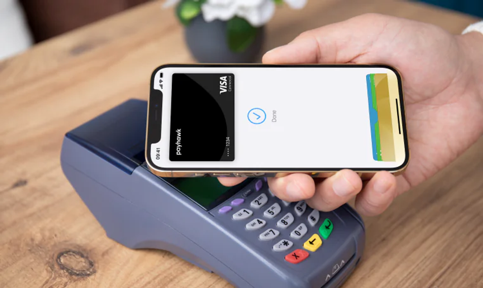

# Looking outside the domain: Tap to do X

Wednesday’s lecture on divergent design really opened my eyes to the idea of drawing inspiration from outside a problem domain, as a means of escaping functional fixation. Specifically, I found the example of similarities between the video editing software and calendar scheduling tool to be particularly interesting. I never would’ve thought to look for commonalities between apps serving such different purposes.

As developers, we borrow and repurpose underlying concepts from one another all the time, and when implemented well enough they can easily pass as original. Take for instance, the popular Apple/Google Wallet feature where you tap your mobile device against the card reader to make a payment. We’ve seen this same “tap to do X” functionality repurposed many times to speed up workflows, even outside of payment processing. If you’ve ever done laundry in an MIT dorm, you likely know that you can tap your phone against a washer/dryer to immediately start your load in CSC GO. Or tapping your iPhone against another person’s iPhone enables NameDrop, allowing you to instantly share your contact cards with one another.

In all of these examples, the underlying concept is the same: tap your device against some target reader to quickly execute what would be a multistep process. Yet, the implications of these implementations are vastly different based on the implied users, reach, and pervasiveness of these features. Take the CSC GO feature for instance, designed for university students who do their laundry on average about once a week. It’s relatively harmless when it comes to privacy and security concerns, but this is far from the case with Apple’s NameDrop. When it was released in iOS 17 to a whopping 1.46 billion active iPhone users worldwide, it prompted a wave of public outcry[^1] from those concerned about data privacy, information theft, and the risk it poses to underage users. 

This got me thinking about the whole opt-out concept as well, which Apple of course included with the rollout of this new feature. For me, this situation served as a reminder to stay conscious of the ethical implications when repurposing ideas in this way. While it may suit your purpose functionally, it may not carry over well ethically if the problem scope or intended user is much, much different.

[^1]: See [Apple's new NameDrop feature has some concerned with the privacy of their information](https://ottawa.ctvnews.ca/apple-s-new-namedrop-feature-has-some-concerned-with-the-privacy-of-their-information-1.6664472)