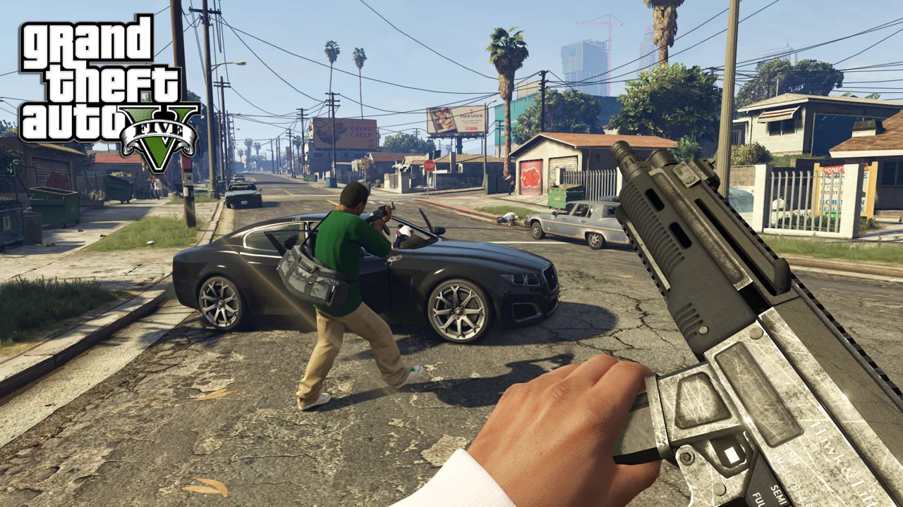
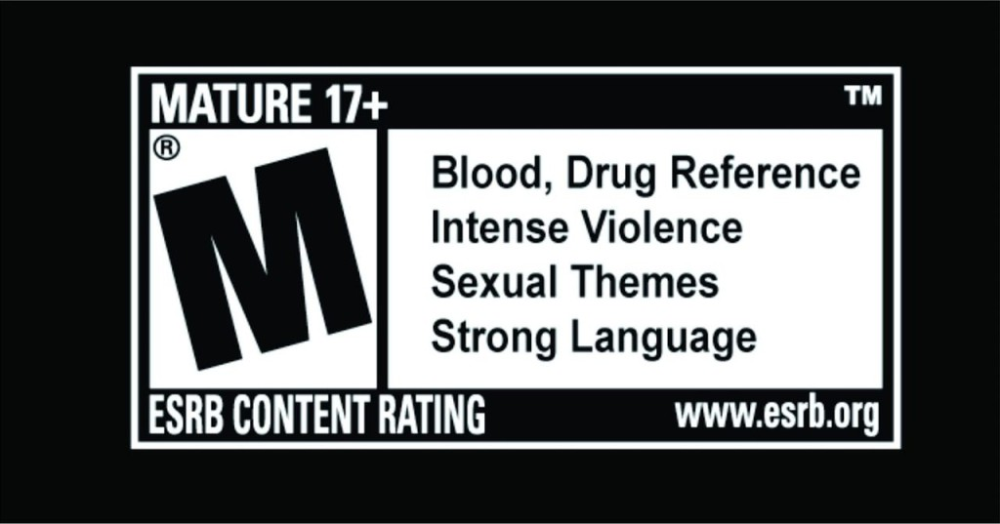

# Revision vs. Retaliation

[The Unintended Effects of Pokemon Go](https://tianajiang.github.io/portfolio-tiana/blogs/blog1.html) makes some pretty valid points about the way in which software we produce can have unwanted effects on stakeholders. And while releasing patches later on is a valid response, it is far more effective to include these concerns in early discussions before the tech actually hits the market, as opposed to making them an afterthought.

Tiana’s example demonstrates an instance in which creators feel compelled to address the issue themselves, in response to public backlash. But what about cases where developers may not budge as easily, and it is instead the stakeholders who must fight back? There are arguably many more hoops for users and lawmakers to jump through, in order to enact change rivaling technology that has already gained a lot of traction and influence.

Take the Mortal Kombat and Grand Theft Auto video game franchises, for example. Both games include varying degrees of blood and violence, and are oftentimes (indirectly) marketed towards younger audiences. While GTA is intended to be a fun, open-world game with missions and a multiplayer mode, some may argue that it unintentionally sends the wrong message to young, impressionable minds. Running over pedestrians, picking up strippers, and shooting at the cops isn’t necessarily the first thing that comes to mind when you think of a gaming experience for kids/teens. But what should the developers at Rockstar Games do when the content they’ve created is meant to be intense, graphic, and provocative? Well, that’s where the governing bodies step in.

The Entertainment Software Ratings Board (ESRB), established in 1994, rated the game as M for mature audiences (17+), effectively labeling the game’s content as sexual and violent in nature. However, the rating alone doesn’t prevent sale of the game to minors. This is something left up to individual retailers like GameStop or Best Buy to enforce (or not). In 2005, former California governor Arnold Schwarzenagger actually signed a bill that banned the sale of violent video games to minors, which was later deemed unconstitutional[^1] and overruled in 2011 by the Supreme Court.

So what do we do in these unique cases, where even band-aid solutions like the ESRB rating system don’t fully address the problem? Where developers are rigid in their design because they’re knowingly contributing to harmful byproducts? How can we, as developers, be mindful even when we know the product we’re building is “bad?”

[^1]: See [Regulation of violent video games sales to minors violates First Amendment](https://rcfp.org/journals/regulation-violent-video-games/)